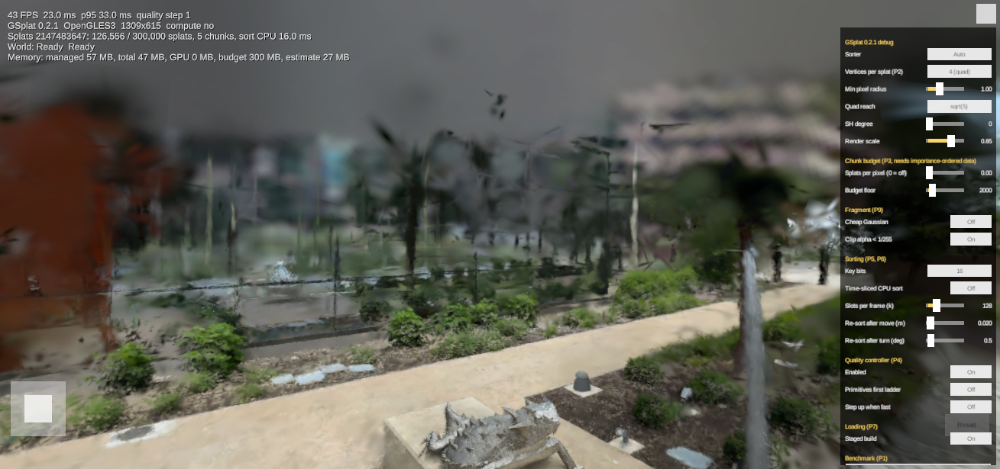

# The debug menu

Every generated scene (the viewer, the sample scenes) has a small `≡` button in the top-right corner. It opens a
panel with the knobs that decide how fast the renderer runs and what it costs in image quality. The point of it is
to try things on a real phone or in a browser without rebuilding: change a knob, watch the FPS in the overlay,
or run the built-in benchmark and read the numbers.

Changes apply on the next frame and are saved on the device, so they survive a restart. "Reset to device profile"
at the bottom forgets them and goes back to what the app picked for this hardware.

The values in the tables below are what you get on a desktop; a phone or a browser starts from the mobile
profile instead (500k splats, quad reach sqrt(5), no view-dependent color, min pixel radius 1.0, 60 FPS cap).

## Rendering

| Knob | Range | Default | What it does | Cost and gain |
|---|---|---|---|---|
| Sorter | Auto, GPU, CPU | Auto | Who sorts the splats back to front every frame. GPU needs compute shaders (phones with Vulkan or GLES 3.1, desktops); the CPU sorter is what WebGL2 gets. Auto picks the GPU when it can. | The GPU sort costs about a millisecond on a desktop GPU and nothing on the CPU. The CPU sort is one Burst job per frame on native platforms; in a browser it runs without Burst and without threads, about 14 ms for 300k splats on a laptop. |
| Vertices per splat | 4 (quad), 3 (triangle) | 4 | Each splat is drawn as a small camera-facing shape. A quad is two triangles; one triangle that contains the same ellipse is a single primitive. The visible pixels are identical, the fragment shader cuts the triangle back to the quad's square. | On tile-based GPUs (every phone) the work of the tiler grows with the number of primitives, so 3 halves that part of the frame. The price is 1.7x the area per splat, and with the 512 px size clamp the biggest splats become very large triangles: in a desktop browser (Chrome, Apple M3 Pro through WebGL2) this made frames three times slower, so on that GPU it is a clear loss. Phones weigh primitives and fill differently; measure before keeping it. |
| Min pixel radius | 0 to 3 px | 0.5 (desktop), 1.0 (mobile) | Splats whose own radius on screen is below this are skipped entirely, before sorting. | The single biggest lever on phones: hundreds of thousands of sub-pixel splats cost as much as big ones and show nothing. Going from 0.3 to 1.0 roughly halved the frame in our measurements. Above 1.5 thin details (grass, wires) start to thin out. |
| Quad reach | sqrt(8), sqrt(5) | sqrt(8) desktop, sqrt(5) mobile | How far out from the center a splat is drawn, in standard deviations. sqrt(8) is the original 3DGS cutoff, sqrt(5) is what the Spark viewer recommends for weak GPUs. | sqrt(5) draws 37% less area per splat; the tail it cuts is below 1/255 alpha, so the image looks the same. Little risk, moderate gain on fill-bound scenes. |
| SH degree | 0 to 3 | 3 desktop, 0 mobile | View-dependent color detail (spherical harmonics). 0 is flat color per splat. Capped by what the file contains; our sample worlds were imported at degree 0. | Each degree adds texture reads per vertex (3, 6 or 12 texels). Degree 3 costs about 10% on a desktop, more on phones. Turn it off first when the scene is vertex-bound. |
| Render scale | 0.5 to 1.0 | 1.0 | URP renders the frame at this fraction of the screen and upscales. | Attacks fill and blending cost only. On tile-based GPUs that is usually not the bottleneck, so it helps less than the primitive knobs above; on a very high-DPI phone it still saves battery. |

## Chunk budget (P3)

Splats are stored in chunks of 65 536 that each cover a compact region of space. When a chunk is imported with
"importance-ordered chunks", the most important splats (opaque and large) come first inside it, so drawing only
the first part of a chunk is a valid lower level of detail for that chunk. The budget uses that: a chunk far
away, covering a few hundred pixels, gets a few hundred splats; a chunk you stand inside gets all of them.

| Knob | Range | Default | What it does |
|---|---|---|---|
| Splats per pixel | 0 to 4 | 0 (off) | How many splats a chunk may draw per pixel of its projected area. 1.0 means one splat per screen pixel of the chunk's bounding sphere; 0.5 halves that. |
| Budget floor | 0 to 20 000 | 2000 | A chunk never gets fewer than this, so a small far chunk still shows something. |

This one changes the image on purpose (it is a level-of-detail scheme), so judge it by eye: start at 1.0 and go
down until you see holes in far surfaces. It needs data imported with the "importance-ordered chunks" option;
the sample scenes have it, other files ignore the budget until re-imported.

## Fragment (P9)

| Knob | Default | What it does | When to try |
|---|---|---|---|
| Cheap Gaussian | Off | Replaces the `exp` falloff with a polynomial that reaches zero at the quad edge. Slightly harder splat edges. | GPUs where `exp` is not a single instruction (older Mali). Usually a small or no gain; measure. |
| Clip alpha < 1/255 | On | Discards fragments too faint to change an 8-bit pixel. Saves blend bandwidth. | On some tile-based GPUs a `discard` in the shader disables fast paths and costs more than it saves. Turn it off and compare. |

## Sorting (P5, P6)

| Knob | Range | Default | What it does | Cost and gain |
|---|---|---|---|---|
| Key bits | 16, 12 | 16 | Depth resolution of the sort: 65 536 or 4 096 depth buckets. Keys are spaced logarithmically, so 12 bits still gives sub-centimeter buckets a few meters from the camera. | 12 bits makes the GPU prefix scan 16x shorter and the CPU histogram fit in cache. Splats in the same bucket blend in arbitrary order; with 12 bits that is visible as faint speckle on thin overlapping surfaces, sometimes. |
| Time-sliced CPU sort | Off | Off | Spreads one CPU sort over several frames instead of doing it in one job. The order lags the camera by a few frames instead of one. | For browsers, where the sort runs on the main thread: the frame no longer waits for the whole sort. On native platforms the job runs on worker threads anyway and this only adds lag. |
| Slots per frame | 16k to 512k | 128k | How much of the sort each frame does in the sliced mode. | Smaller = smoother frames, longer lag. |
| Re-sort after move | 0 to 0.5 m | 0.02 | The camera has to move this far before the order is rebuilt. | Sorting is skipped while you stand still. Larger values skip more sorts while walking; the order goes stale a little sooner. |
| Re-sort after turn | 0 to 10 degrees | 0.5 | The same for turning. With the radial order (the default) turning alone would not change the order, but the sort also culls splats outside the view, so a turn needs a re-sort. | Larger values mean splats that just came into view appear a frame or two late at the screen edge. |

## Quality controller (P4)

The controller watches the 95th percentile of the frame time over three seconds and, when it stays above 40 ms,
steps one rung down a ladder, then waits 30 seconds before the next step.

| Knob | Default | What it does |
|---|---|---|
| Enabled | On | Turn the automatic steps off while you are testing knobs by hand, otherwise it will change them under you. |
| Primitives first ladder | Off | Off: render scale 0.85, 0.7, then quad reach sqrt(5), then SH off. On: min pixel radius 1.5, 2.0, then chunk budget 0.5, then the render scale rungs, reach and SH. The second order fits tile-based GPUs, where primitives cost more than pixels. |
| Step up when fast | Off | Climb back up one rung when the frame time stays under 60% of the threshold for the hold time. Off, the controller only ever goes down. |

## Loading (P7)

| Knob | Default | What it does |
|---|---|---|
| Staged build | On | Puts a frame between the stages that turn a downloaded file into GPU data (filter, order, pack). The load takes a few frames longer and the app does not freeze for hundreds of milliseconds at the end of a download. In a browser the SPZ decoder also runs one attribute per frame. |

## Benchmark (P1)

Two buttons run the same measurement: a fixed camera motion (a slow look around with a little walking) for 20
seconds after a 1 second warmup, with the fly camera and the quality controller off.

- "Run 20 s with current settings" measures the knobs as they are.
- "Run the knob matrix" measures your current settings, then one knob changed at a time: min pixel radius 0.5,
  1.0, 1.5, 2.0; render scale 0.85, 0.7; reach sqrt(5); triangle; sorter GPU and CPU; 12-bit keys; cheap Gaussian;
  no alpha clip; chunk budget 1.0 and 0.5. Sixteen runs, about six minutes.

Each run records mean, median and 95th percentile frame time, FPS, the number of splats actually drawn, the CPU
sort time and the GPU frame time where the platform reports it. The report is one JSON file in the app's data
folder (the path is shown under the buttons; on Android that is under `Android/data/<package>/files`), and the
same JSON is printed to the log. In a browser it goes to the console. Add `?bench=matrix` or `?bench=single` to
the viewer page URL to start it without touching the menu.

## Other

| Knob | Default | What it does |
|---|---|---|
| Show overlay | On | The text block in the top-left with FPS, drawn splats, sorter, memory. F3 toggles it on a keyboard. |
| Reset to device profile | | Forgets the saved knobs and returns to the profile the app picked for this device. |

## Where the settings live

`SplatDebugSettings.Current` is the one object all of this edits. `SplatSettingsApplier` on the Viewer object pushes
it onto every renderer, the URP asset and the quality controller each frame, so the loader's renderers get the same
values as the ones in the scene. A scene without that component ignores the menu and keeps its inspector values.
