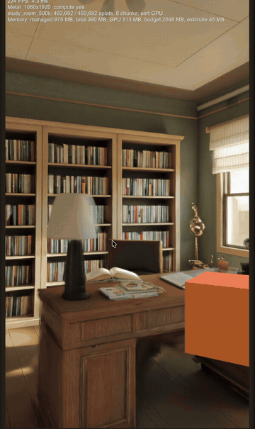

# GaussPlatUnity

A Gaussian splat renderer for Unity 6 and URP. I started it because I wanted to show
generated 3D worlds on phones and in the browser,
inside normal Unity scenes, and the existing Unity splat renderers either need D3D12/Metal/Vulkan
with wave intrinsics or were never meant for mobile.

What it does today:

- reads `.spz` (Niantic, versions 1 to 3) and 3DGS `.ply`, imports them into a compact GPU layout
- draws splats through a URP Renderer Feature, depth-tested against regular geometry
- sorts on the GPU with a compute shader that uses no wave intrinsics, or on the CPU with Burst
  when there is no compute (WebGL2, old GLES). Same shader everywhere, shader model 3.5
- loads worlds progressively: a small preview first, then the full level with a crossfade,
  and steps quality down when the frame time or memory says so
- comes with a viewer scene: fly/walk camera, touch gestures, joystick, debug overlay

What it does not do yet: SPZ version 4 (zstd), LOD streaming, editing. Splats are drawn after the
skybox and before URP transparents, so particles always end up on top of them.

Tested so far on a Mac (Metal). Android and WebGL builds compile and start, but I have not measured
them on real phones yet. Numbers I have: the horned lizard sample from Niantic (786k splats) renders
at 1080x1920 in about 6 ms on Apple Silicon, and matches the Spark web viewer at 38 dB PSNR from the
same camera.

See [QUICKSTART.md](QUICKSTART.md) to get a scene on screen in a few minutes, [HOW-IT-WORKS.md](HOW-IT-WORKS.md)
for the long explanation of the pipeline, [DEBUG-MENU.md](DEBUG-MENU.md) for the in-app menu that lets you try
every performance knob on a phone or in a browser, and [CHANGELOG.md](CHANGELOG.md) for what changed between
versions.

Requires Unity 6000.3.19f1. The package lives in `Packages/com.denisislamov.gsplat` and can be
copied into any URP project. MIT license. Sample scenes in `Assets/Samples/Niantic` are from the
[spz repository](https://github.com/nianticlabs/spz), also MIT.

## Support

If this saved you some time and you feel like buying me a coffee:

- Boosty: https://boosty.to/islamovdenis/donate
- USDT (TRON, TRC20): `TN7uL8cvwgGHRtxwCsTsyjcQvMFqjkDJTE`

